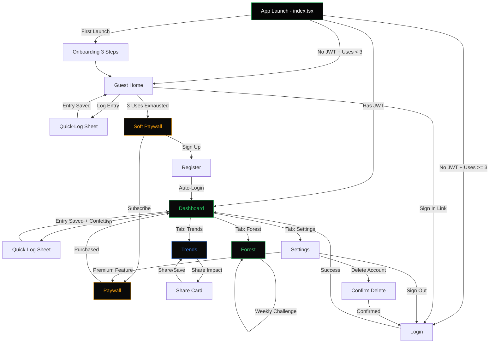

# CarbonMint — Master Specification

> Track your footprint, grow your impact

Generated: 2026-02-14T12:03:22.734367+00:00 | Pipeline v1.0.0

## 1. App Overview

**Name:** CarbonMint
**Tagline:** Track your footprint, grow your impact
**Description:** A personal carbon footprint tracker that combines manual activity logging with AI-powered estimates to give users a clear, honest picture of their daily environmental impact. Unlike competitors that require hardware or bank connections, CarbonMint works for everyone — any income level, any lifestyle. Gamified challenges and a tree-planting streak system keep users engaged while actually reducing their footprint.
**Target Audience:** Environmentally conscious millennials and Gen Z (18-35) who want to reduce their carbon footprint but find existing apps too complex, too exclusive, or too hardware-dependent
**Differentiator:** No hardware required, no bank account linking, no income bias. Pure manual + smart-estimate tracking that works for anyone, with honest carbon math instead of reward gimmicks that feel scammy. The virtual forest gamification creates emotional investment without misleading reward redemption.
**Feasibility:** moderate (10 days)
**Confidence:** 82%

## 2. Tech Stack (Fixed)

- **Mobile:** Expo SDK 54 + React Native 0.81 + NativeWind v4 + Expo Router v6
- **Backend:** Go-Fiber v2 + GORM + PostgreSQL
- **Auth:** JWT + Sign in with Apple
- **Payments:** RevenueCat
- **Deployment:** Coolify PaaS
- **Ci Cd:** EAS Build + Fastlane

## 3. Core Features

1. Quick-log carbon entries: transport, food, energy, shopping with tap-to-add categories
2. AI-powered daily carbon score with relatable equivalents (cups of coffee, km driven, trees needed)
3. 7-day and 30-day trend charts with category breakdown (Bento grid dashboard)
4. Personalized reduction tips based on user's highest-impact categories using on-device analysis
5. Green streak counter with loss-aversion messaging and weekly challenges
6. Virtual forest that grows with consistent low-carbon days (gamification reward system)
7. Share your impact cards — beautiful shareable images of weekly/monthly progress
8. Offline-first with local storage, optional cloud backup

## 4. Market Research

**Market Size:** TAM estimated at $2-3B globally for personal carbon tracking apps by 2026, with SAM of ~$500M for mobile-first solutions. Based on review counts (leading apps have 8,000-9,000 reviews), active user base appears to be in the hundreds of thousands per major app. Growing interest driven by climate awareness and corporate sustainability mandates.
**Sentiment:** positive (3.8/5)
**Competitors:** 7
**Trends:** AI and digital carbon footprint tracking emerging as new concern area, Real-time carbon monitoring becoming expected feature, Scope 3 emissions tracking moving from advanced to default requirement

### Pain Points

- **Apps breaking after updates, with poor customer support to resolve issues** (severity: 9/10, freq: 7/10)
- **Lack of manual input options - users forced into automatic tracking they can't control** (severity: 7/10, freq: 6/10)
- **Apps designed only for wealthy users, excluding lower-income demographics** (severity: 6/10, freq: 5/10)
- **Reward redemption feels scammy or misleading - promised rewards don't materialize as expected** (severity: 8/10, freq: 4/10)
- **Hardware connectivity issues with smart meters and energy monitors** (severity: 8/10, freq: 6/10)

### Competitors

| App | Rating | Reviews | Price | Strengths | Weaknesses |
|-----|--------|---------|-------|-----------|------------|
| Treecard | 4.5 | 8,066 | freemium | Gamification through tree planting rewards, Strong community engagement (4M+ trees planted) | iPad compatibility issues, Limited spending options for actions |
| Emporia Energy | 4.8 | 9,047 | free | Excellent data visualization, Easy hardware installation | Requires hardware purchase, Limited aggregation features |
| Sense Home | 4.6 | 2,085 | free | Detailed energy analysis, Carbon footprint reduction focus | Frequent breaking updates, Poor customer service |
| Earth Hero | 4.9 | 801 | free | Goal-setting features, Empowering user experience | Smaller user base, Less sophisticated tracking |
| Commons | 4.8 | 949 | freemium | Spending tracking integration, Intentional spending prompts | Targeted only at upper-middle class, No manual input option |
| Carbon-Tracker | 5.0 | 1 | free | Vehicle, gas, and electricity tracking, Simple focused approach | No user base to validate quality, Limited feature set |
| Carbon Footprint Tracker | 5.0 | 5 | free | Educational focus on climate change, Simple interface | Very small user base, Limited reviews for validation |

## 5. Design System

**Style:** Eco-Modern Glassmorphism

### Colors

| Token | Hex | Usage |
|-------|-----|-------|
| primary | `#00D9A5` | Primary actions, carbon score highlights, active states |
| primaryDark | `#00B386` | Pressed state, darker variant for depth |
| secondary | `#1A3A4A` | Secondary backgrounds, deep ocean tones |
| accent | `#FF7B54` | CTAs, streak flames, high-impact warnings |
| background | `#F8FAF9` | Light mode main background |
| surface | `#FFFFFF` | Card backgrounds, elevated surfaces |
| surfaceElevated | `#F0F5F3` | Modals, dropdowns, floating elements |
| textPrimary | `#1A2E25` | Primary text, headings, important data |
| textSecondary | `#5A6B63` | Secondary text, captions, metadata |
| textMuted | `#8A9A92` | Disabled text, placeholders, hints |
| border | `#D8E5E0` | Input borders, dividers, separators |
| success | `#22C55E` | Low carbon indicators, positive actions |
| warning | `#F59E0B` | Medium carbon alerts, caution states |
| error | `#EF4444` | High carbon alerts, error states |
| transport | `#6366F1` | Transport category accent |
| food | `#F97316` | Food category accent |
| energy | `#EAB308` | Energy category accent |
| shopping | `#EC4899` | Shopping category accent |
| forest | `#059669` | Virtual forest, tree growth elements |
| hazeStart | `#00D9A5` | AI gradient haze start - mint |
| hazeMid | `#0EA5E9` | AI gradient haze middle - sky |
| hazeEnd | `#8B5CF6` | AI gradient haze end - violet |

### Dark Mode Overrides

| Token | Hex | Usage |
|-------|-----|-------|
| background | `#000000` | OLED true black background |
| surface | `#0D1A14` | Dark card backgrounds |
| surfaceElevated | `#142420` | Dark elevated surfaces, modals |
| textPrimary | `#F0F5F3` | Dark mode primary text |
| textSecondary | `#A3B5AB` | Dark mode secondary text |
| textMuted | `#6B7D74` | Dark mode muted text |
| border | `#1F3A30` | Dark mode borders |
| glassTint | `#1A3A2E` | Glassmorphism overlay tint |
| primary | `#00F5B8` | Brighter primary for dark contrast |
| accent | `#FF8F6B` | Brighter accent for dark mode |

### Typography

- **displayLarge:** 36px bold, line-height: 1.1
- **displayMedium:** 28px bold, line-height: 1.2
- **heading1:** 24px semibold, line-height: 1.25
- **heading2:** 20px semibold, line-height: 1.3
- **heading3:** 18px semibold, line-height: 1.35
- **bodyLarge:** 17px normal, line-height: 1.5
- **body:** 15px normal, line-height: 1.5
- **bodySmall:** 14px normal, line-height: 1.45
- **caption:** 12px medium, line-height: 1.4
- **micro:** 10px medium, line-height: 1.3
- **numberHero:** 56px bold, line-height: 1.0
- **numberLarge:** 40px bold, line-height: 1.0
- **numberMedium:** 28px semibold, line-height: 1.0

### Component Styles

- **buttonPrimary:** radius=14px, padding=`px-6 py-4`, shadow=`shadow-lg` Min 52px height, haptic on press, scale animation
- **buttonSecondary:** radius=14px, padding=`px-6 py-4`, shadow=`shadow-sm` Ghost style with 1.5px border, min 52px height
- **buttonCategory:** radius=18px, padding=`p-4`, shadow=`shadow-md` Quick-log category, 56x56px touch target
- **card:** radius=20px, padding=`p-5`, shadow=`shadow-sm` Standard content card
- **cardGlass:** radius=24px, padding=`p-5`, shadow=`shadow-xl` Glassmorphism with backdrop-blur-xl, border-white/10
- **bentoCell:** radius=20px, padding=`p-4`, shadow=`shadow-sm` Bento grid dashboard cell
- **bentoHero:** radius=28px, padding=`p-6`, shadow=`shadow-lg` Large bento cell for carbon score with gradient haze
- **input:** radius=14px, padding=`px-4 py-4`, shadow=`` Min 48px height, 1.5px border
- **chip:** radius=9999px, padding=`px-4 py-2`, shadow=`` Category filter chips, min 36px height
- **modal:** radius=28px, padding=`p-6`, shadow=`shadow-2xl` Bottom sheet with drag handle
- **progressRing:** radius=9999px, padding=``, shadow=`` Circular progress, 8px stroke width
- **treeElement:** radius=16px, padding=`p-3`, shadow=`shadow-md` Virtual forest tree with subtle glow
- **shareCard:** radius=24px, padding=`p-6`, shadow=`shadow-xl` Impact share card with gradient background
- **streakBadge:** radius=16px, padding=`px-4 py-2`, shadow=`shadow-md` Streak counter with flame accent
- **tipCard:** radius=16px, padding=`p-4`, shadow=`shadow-sm` AI-powered reduction tip card

### Design Notes

- AI Gradient Haze: Carbon score hero uses animated gradient (mint→sky→violet) creating living data visualization that pulses subtly
- OLED Deep Dark: True black (#000000) background maximizes OLED battery efficiency and makes mint green visually striking
- Bento Grid: Dashboard uses asymmetric bento layout - hero score cell (2x2), trend charts (2x1), category stats (1x1)
- Glassmorphism: Category selection modal and share cards use backdrop-blur-xl with border-white/10 for frosted effect
- Touch targets: All interactive elements meet 44x44px minimum, category buttons use generous 56x56px
- Haptic-visual sync: Button press, streak milestone, and tree growth trigger synchronized haptic + visual feedback
- Color psychology: Mint evokes freshness/growth, amber accent creates urgency without eco-anxiety
- Number typography: Hero numbers use tabular-nums for alignment, designed for carbon score prominence
- Accessibility: WCAG AA contrast on all text, icons accompany color for category identification
- Virtual forest: Trees scale up with spring animation, particle effects on new tree growth
- Dark mode: Glassmorphism adapts with darker tint, gradient haze becomes more vibrant against black

## 6. UX Architecture

**Navigation:** custom_tabs

### Tab Bar

| Label | Icon | Route |
|-------|------|-------|
| - | leaf | dashboard |
| - | tree-outline | forest |
| - | bar-chart-outline | trends |
| - | settings-outline | settings |

### Screens

#### index
- **Route:** `app/index.tsx`
- **Description:** Smart router: checks AsyncStorage for onboarding completion, guest usage count, and SecureStore for JWT. Routes to onboarding (first launch), guest-home (not logged in, uses < 3), auth/login (uses exhausted), or (protected)/dashboard (authenticated).
- **Components:** ActivityIndicator, SplashRedirectLogic

#### _layout
- **Route:** `app/_layout.tsx`
- **Description:** Root layout: wraps app in AuthProvider, SubscriptionProvider, StatusBar (light-content), SafeAreaProvider. Uses Slot (NOT Stack). Sets global background to #050505.
- **Components:** Slot, AuthProvider, SubscriptionProvider, SafeAreaProvider, StatusBar

#### onboarding
- **Route:** `app/onboarding.tsx`
- **Description:** 3-step horizontal FlatList onboarding. Step 1: 'Track Your Footprint' — animated globe icon with green pulse, headline 'Know your impact in seconds', subtext 'Log meals, rides, and purchases with a single tap'. Step 2: 'Grow Your Forest' — animated tree sprouting, headline 'Every low-carbon day plants a tree', subtext 'Watch your virtual forest thrive as you make greener choices'. Step 3: 'Join the Movement' — share card mockup, headline 'Inspire your circle', subtext 'Share beautiful impact cards and challenge friends', CTA button 'Get Started' (#22C55E). Pagination dots: active #22C55E, inactive #2C2C2E. Skip button top-right on steps 1-2. On complete, sets AsyncStorage 'onboarding_complete' = 'true' and routes to guest-home.
- **Components:** FlatList, Animated.View, PaginationDots, SkipButton, CTAButton

#### guest-home
- **Route:** `app/guest-home.tsx`
- **Description:** Guest landing screen showing app value before sign-up. Displays a sample carbon score card (367g CO₂ today — 'That's 1.5 cups of coffee'), a mini trend chart placeholder, and a prominent 'Log Your First Entry' button (#22C55E). Shows usage badge 'X of 3 free logs remaining' at top. After 3 uses, shows soft paywall modal. Bottom: 'Already have an account? Sign in' link routing to auth/login.
- **Components:** SampleScoreCard, UsageBadge, CTAButton, SignInLink, SoftPaywallModal

#### login
- **Route:** `app/(auth)/login.tsx`
- **Description:** Login screen with dark theme. App logo (leaf icon in #22C55E circle) at top. Email input (placeholder: 'email@example.com') and password input with show/hide toggle. 'Sign In' button full-width (#22C55E bg, #050505 text, font-bold). Divider '— or —'. Apple Sign In button (white outline). Bottom: 'New here? Create account' linking to register. Error state: red (#EF4444) text below inputs.
- **Components:** LogoIcon, TextInput, PasswordInput, PrimaryButton, AppleSignInButton, ErrorText, RegisterLink
- **API Calls:** POST /api/auth/login, POST /api/auth/apple

#### register
- **Route:** `app/(auth)/register.tsx`
- **Description:** Registration screen. Same dark theme. Fields: email, password (min 8 chars, strength indicator bar), confirm password. 'Create Account' button (#22C55E). Apple Sign In button below. On success: auto-login (store tokens in SecureStore), haptic success, navigate to (protected)/dashboard. Bottom: 'Already have an account? Sign in' linking to login.
- **Components:** TextInput, PasswordInput, PasswordStrengthBar, PrimaryButton, AppleSignInButton, SuccessAnimation
- **API Calls:** POST /api/auth/register, POST /api/auth/apple

#### _layout (auth)
- **Route:** `app/(auth)/_layout.tsx`
- **Description:** Auth group layout. Uses Slot. No tab bar. Background #050505.
- **Components:** Slot

#### _layout (protected)
- **Route:** `app/(protected)/_layout.tsx`
- **Description:** Protected group layout. Checks isAuthenticated from AuthContext — redirects to auth/login if false. Uses Slot + custom bottom tab bar (4 tabs). Tab bar: bg #0A0A0A, border-top 1px #1C1C1E, height 80px (includes safe area). Active tab: icon + label in #22C55E. Inactive tab: icon + label in #6B7280. Haptic light feedback on tab press.
- **Components:** Slot, CustomTabBar, Pressable, Ionicons, HapticFeedback

#### dashboard
- **Route:** `app/(protected)/dashboard.tsx`
- **Description:** Main dashboard — Bento grid layout. Top section: greeting 'Good morning, {name}' + date. Green streak badge: flame icon + '{N}-day streak 🔥' in #22C55E pill. Bento grid (2-column): Card 1 (full-width): Today's Carbon Score — large number (e.g., '2.4 kg CO₂'), equivalence text ('≈ 12 km driven' or '≈ 8 cups of coffee'), circular progress ring (green-to-red gradient based on score vs daily goal of 6.8kg). Card 2 (half-width): Category Breakdown — mini donut chart with 4 segments: Transport #3B82F6, Food #F59E0B, Energy #8B5CF6, Shopping #EC4899. Card 3 (half-width): Weekly Trend — mini sparkline chart for last 7 days, green line on dark bg. Card 4 (full-width): Reduction Tips — horizontal scroll of 2-3 tip cards with icon + short text ('Switch to bus twice a week → save 3.2 kg'). Bottom: floating '+' FAB button (#22C55E, shadow-lg) that opens quick-log bottom sheet. Pull-to-refresh updates all data.
- **Components:** GreetingHeader, StreakBadge, BentoGrid, CarbonScoreCard, CircularProgress, DonutChart, SparklineChart, TipCard, ScrollView, FABButton, RefreshControl
- **API Calls:** GET /api/entries/today, GET /api/entries/weekly, GET /api/tips

#### quick-log
- **Route:** `app/(protected)/quick-log.tsx`
- **Description:** Bottom sheet modal for logging a carbon entry. Presented as a bottom sheet (70% screen height) with drag handle. 4 category tabs at top: Transport (car icon, #3B82F6), Food (restaurant icon, #F59E0B), Energy (flash icon, #8B5CF6), Shopping (cart icon, #EC4899). Each category shows a grid of common items as tappable chips: Transport: Car, Bus, Train, Bike, Walk, Flight. Food: Beef, Chicken, Vegetarian, Vegan, Dairy, Seafood. Energy: Heating, AC, Laundry, Cooking, Shower. Shopping: Clothing, Electronics, Groceries, Online Order. On chip tap: haptic medium, slide-up quantity/detail selector (e.g., 'How far? 5km / 10km / 25km / Custom'). CO₂ estimate shown in real-time as user selects (e.g., '+1.2 kg CO₂'). 'Log Entry' button at bottom (#22C55E). Success: haptic success, confetti micro-animation, sheet dismisses, dashboard refreshes.
- **Components:** BottomSheet, CategoryTabs, ChipGrid, QuantitySelector, CO2Estimate, PrimaryButton, ConfettiAnimation, DragHandle
- **API Calls:** POST /api/entries

#### forest
- **Route:** `app/(protected)/forest.tsx`
- **Description:** Virtual forest gamification screen. Top: current streak count + best streak. Main area: illustrated forest scene on dark bg — trees rendered as styled SVG/images. Each tree represents a low-carbon day (daily score < 6.8kg goal). Tree stages: seedling (day 1), sapling (day 3), small tree (day 7), full tree (day 14), flowering tree (day 30). Dead/wilted tree for missed days (> 8kg). Forest shows last 30 days as a 5x6 grid of tree icons. Stats bar below: 'Trees Planted: 23', 'Best Streak: 12 days', 'Carbon Saved: 45.2 kg'. Weekly challenge card at bottom: 'This Week: Take public transit 3 times' with progress bar (1/3). Loss-aversion message when streak is active: 'Don't break your {N}-day streak! Log today's entries.' in amber (#F59E0B) if no entry logged yet today.
- **Components:** StreakHeader, ForestGrid, TreeIcon, StatsBar, WeeklyChallengeCard, ProgressBar, LossAversionBanner
- **API Calls:** GET /api/forest, GET /api/challenges/current

#### trends
- **Route:** `app/(protected)/trends.tsx`
- **Description:** Detailed analytics screen. Toggle at top: '7 Days' | '30 Days' (pill selector, active #22C55E bg). Main chart: stacked bar chart showing daily CO₂ by category (Transport #3B82F6, Food #F59E0B, Energy #8B5CF6, Shopping #EC4899). Horizontal goal line at 6.8kg (dashed #22C55E). Below chart: category breakdown list — each row has colored dot, category name, total kg, percentage of total, trend arrow (up red/down green vs previous period). Bottom section: 'Your Equivalents This Period' — fun cards: '≈ {N} cups of coffee', '≈ {N} km driven', '≈ {N} trees needed to offset'. Share button at bottom: 'Share Your Impact' (#22C55E outline button) → generates shareable image card.
- **Components:** PeriodToggle, StackedBarChart, GoalLine, CategoryBreakdownList, TrendArrow, EquivalentCards, ShareButton
- **API Calls:** GET /api/entries/trends?period=7, GET /api/entries/trends?period=30

#### share-card
- **Route:** `app/(protected)/share-card.tsx`
- **Description:** Shareable impact card generator. Shows a preview of a beautifully designed card (dark bg with green gradient border): App logo top-left, period label ('My Week in Carbon'). Large stat: total CO₂ + trend. Mini chart. Equivalence ('I saved {N} trees worth!'). QR code or app link at bottom. User can toggle period (week/month). 'Share' button uses expo-sharing to share as image. 'Save to Photos' secondary button. Card rendered via ViewShot for image capture.
- **Components:** ShareCardPreview, PeriodToggle, ViewShot, ShareButton, SaveButton, GradientBorder
- **API Calls:** GET /api/entries/trends?period=7

#### settings
- **Route:** `app/(protected)/settings.tsx`
- **Description:** Settings screen. Sections: Profile (avatar placeholder with initials, name, email, edit button). Preferences (daily goal slider: 3-10 kg CO₂, default 6.8kg; units: kg/lbs toggle; notifications: daily reminder toggle + time picker). Data (cloud backup toggle — premium feature with lock icon if free; export data as CSV; clear local data with confirmation). Subscription (current plan badge, 'Upgrade to Pro' button if free → navigates to paywall). Account (Privacy Policy link, Terms of Service link, Sign Out button in #EF4444, Delete Account button in #EF4444 outline with confirmation modal). App version at bottom in #6B7280.
- **Components:** ProfileSection, GoalSlider, ToggleSwitch, TimePicker, SectionList, SubscriptionBadge, DeleteAccountModal, SignOutButton
- **API Calls:** GET /api/user/profile, PUT /api/user/preferences, DELETE /api/auth/account, POST /api/auth/logout

#### paywall
- **Route:** `app/(protected)/paywall.tsx`
- **Description:** Contextual paywall screen. Shown after 3 guest uses or when tapping premium features. Dark bg with green gradient glow at top. Headline: 'Unlock Your Full Impact'. Feature comparison: Free (3 logs/day, 7-day trends, basic tips) vs Pro (unlimited logs, 30-day trends, AI coaching, cloud backup, share cards, challenges). Pricing cards: Weekly $2.99 (small text 'most flexible'), Monthly $4.99 (no badge), Annual $39.99 (badge: 'BEST VALUE — save 35%', highlighted border #22C55E). CTA button: 'Start Your Green Journey' (#22C55E). Restore purchases link below. Terms text at bottom. Close X button top-right.
- **Components:** GradientGlow, FeatureComparison, PricingCard, CTAButton, RestorePurchasesLink, CloseButton

#### entry-detail
- **Route:** `app/(protected)/entry-detail.tsx`
- **Description:** Detail view for a single carbon entry. Shows category icon + color, item name, quantity, calculated CO₂, timestamp. Edit and delete buttons. Equivalence text for this single entry. Back button to return to previous screen.
- **Components:** CategoryIcon, EntryInfo, EquivalenceText, EditButton, DeleteButton, BackButton
- **API Calls:** GET /api/entries/:id, PUT /api/entries/:id, DELETE /api/entries/:id

### User Flows

- **first_launch:** index → onboarding → guest-home
  First app open: index checks no onboarding flag → routes to onboarding (3 steps) → on complete routes to guest-home where user can try logging entries.
- **guest_usage:** guest-home → quick-log → guest-home → paywall
  Guest taps 'Log Your First Entry' → quick-log bottom sheet → logs entry → returns to guest-home with updated sample view. After 3 logs, soft paywall modal appears prompting sign-up or purchase.
- **registration:** guest-home → register → dashboard
  Guest taps 'Create Account' from guest-home or paywall → register screen → on success auto-login → navigate to dashboard with all guest entries migrated.
- **login:** login → dashboard
  Returning user: index detects no JWT → routes to login → user signs in → navigate to dashboard.
- **daily_logging:** dashboard → quick-log → dashboard
  Primary loop: user taps FAB on dashboard → quick-log bottom sheet opens → select category → select item → set quantity → see CO₂ estimate → tap Log Entry → confetti + haptic → sheet dismisses → dashboard refreshes with new score.
- **check_trends:** dashboard → trends → share-card
  User taps Trends tab → views 7-day or 30-day charts → taps 'Share Your Impact' → share-card screen → customize period → share or save image.
- **forest_engagement:** dashboard → forest
  User taps Forest tab → views virtual forest with tree grid → checks streak count → reads weekly challenge → motivated by loss-aversion message if no entry today.
- **settings_management:** dashboard → settings → paywall
  User taps Settings tab → manages profile, preferences, daily goal → taps premium feature (cloud backup) → paywall screen if not subscribed.
- **account_deletion:** settings → login
  User in settings → taps Delete Account → confirmation modal with password input → confirms → account deleted → redirected to login.

### Flow Diagram

## 7. Backend Specification

### GORM Models

**User**
  {'ID': 'uuid;default:gen_random_uuid();primaryKey', 'Email': 'string;uniqueIndex;not null', 'PasswordHash': 'string', 'AppleUserID': 'string;uniqueIndex', 'DisplayName': "string;default:''", 'AvatarURL': "string;default:''", 'IsPremium': 'bool;default:false', 'PremiumExpiresAt': '*time.Time', 'OnboardingCompleted': 'bool;default:false', 'DailyGoalKg': 'float64;default:7.0', 'PreferredUnit': "string;default:'kg'", 'NotificationsEnabled': 'bool;default:true', 'StreakReminderHour': 'int;default:20', 'CreatedAt': 'time.Time', 'UpdatedAt': 'time.Time', 'DeletedAt': 'gorm.DeletedAt;index'}

**RefreshToken**
  {'ID': 'uuid;default:gen_random_uuid();primaryKey', 'UserID': 'uuid;index;not null', 'TokenHash': 'string;uniqueIndex;not null', 'ExpiresAt': 'time.Time;not null', 'Revoked': 'bool;default:false', 'CreatedAt': 'time.Time', 'DeletedAt': 'gorm.DeletedAt;index'}

**CarbonEntry**
  {'ID': 'uuid;default:gen_random_uuid();primaryKey', 'UserID': 'uuid;index;not null', 'Category': "string;not null;check:category IN ('transport','food','energy','shopping')", 'Subcategory': 'string;not null', 'CarbonKg': 'float64;not null', 'Label': 'string;not null', 'IconName': "string;default:''", 'EntryDate': 'time.Time;index;not null', 'Notes': "string;default:''", 'Source': "string;default:'manual'", 'CreatedAt': 'time.Time', 'UpdatedAt': 'time.Time', 'DeletedAt': 'gorm.DeletedAt;index'}

**DailySummary**
  {'ID': 'uuid;default:gen_random_uuid();primaryKey', 'UserID': 'uuid;not null', 'Date': 'time.Time;not null', 'TotalCarbonKg': 'float64;default:0', 'TransportKg': 'float64;default:0', 'FoodKg': 'float64;default:0', 'EnergyKg': 'float64;default:0', 'ShoppingKg': 'float64;default:0', 'EntryCount': 'int;default:0', 'CarbonScore': 'int;default:0', 'ScoreLabel': "string;default:''", 'CoffeeEquivalent': 'float64;default:0', 'KmDrivenEquivalent': 'float64;default:0', 'TreesNeededEquivalent': 'float64;default:0', 'CreatedAt': 'time.Time', 'UpdatedAt': 'time.Time', 'DeletedAt': 'gorm.DeletedAt;index'}

**Streak**
  {'ID': 'uuid;default:gen_random_uuid();primaryKey', 'UserID': 'uuid;uniqueIndex;not null', 'CurrentStreak': 'int;default:0', 'LongestStreak': 'int;default:0', 'LastGreenDate': '*time.Time', 'TotalGreenDays': 'int;default:0', 'StreakFreezes': 'int;default:0', 'CreatedAt': 'time.Time', 'UpdatedAt': 'time.Time', 'DeletedAt': 'gorm.DeletedAt;index'}

**Challenge**
  {'ID': 'uuid;default:gen_random_uuid();primaryKey', 'Title': 'string;not null', 'Description': 'string;not null', 'Category': 'string;not null', 'TargetReductionKg': 'float64;not null', 'DurationDays': 'int;not null', 'DifficultyLevel': "string;not null;check:difficulty_level IN ('easy','medium','hard')", 'IconName': "string;default:'leaf'", 'RewardTreeCount': 'int;default:1', 'IsActive': 'bool;default:true', 'CreatedAt': 'time.Time', 'UpdatedAt': 'time.Time', 'DeletedAt': 'gorm.DeletedAt;index'}

**UserChallenge**
  {'ID': 'uuid;default:gen_random_uuid();primaryKey', 'UserID': 'uuid;index;not null', 'ChallengeID': 'uuid;not null', 'Status': "string;default:'active';check:status IN ('active','completed','failed','abandoned')", 'StartDate': 'time.Time;not null', 'EndDate': 'time.Time;not null', 'ProgressKg': 'float64;default:0', 'CompletedAt': '*time.Time', 'CreatedAt': 'time.Time', 'UpdatedAt': 'time.Time', 'DeletedAt': 'gorm.DeletedAt;index'}

**VirtualTree**
  {'ID': 'uuid;default:gen_random_uuid();primaryKey', 'UserID': 'uuid;index;not null', 'TreeType': "string;not null;default:'oak'", 'GrowthStage': 'int;default:0;check:growth_stage BETWEEN 0 AND 5', 'PlantedAt': 'time.Time;not null', 'LastWateredAt': '*time.Time', 'PositionX': 'float64;default:0', 'PositionY': 'float64;default:0', 'EarnedFrom': "string;default:'streak'", 'CreatedAt': 'time.Time', 'UpdatedAt': 'time.Time', 'DeletedAt': 'gorm.DeletedAt;index'}

**ForestStats**
  {'ID': 'uuid;default:gen_random_uuid();primaryKey', 'UserID': 'uuid;uniqueIndex;not null', 'TotalTrees': 'int;default:0', 'MatureTrees': 'int;default:0', 'TotalCO2SavedKg': 'float64;default:0', 'ForestLevel': 'int;default:1', 'ForestName': "string;default:'My Forest'", 'CreatedAt': 'time.Time', 'UpdatedAt': 'time.Time', 'DeletedAt': 'gorm.DeletedAt;index'}

**ShareCard**
  {'ID': 'uuid;default:gen_random_uuid();primaryKey', 'UserID': 'uuid;index;not null', 'ShareToken': 'string;uniqueIndex;not null', 'CardType': "string;not null;check:card_type IN ('weekly','monthly','streak','forest','challenge')", 'PeriodStart': 'time.Time;not null', 'PeriodEnd': 'time.Time;not null', 'TotalCarbonKg': 'float64;default:0', 'ReductionPercent': 'float64;default:0', 'TopCategory': "string;default:''", 'TreesCount': 'int;default:0', 'StreakDays': 'int;default:0', 'Payload': "jsonb;default:'{}'", 'ViewCount': 'int;default:0', 'ExpiresAt': 'time.Time;not null', 'CreatedAt': 'time.Time', 'DeletedAt': 'gorm.DeletedAt;index'}

**CloudBackup**
  {'ID': 'uuid;default:gen_random_uuid();primaryKey', 'UserID': 'uuid;index;not null', 'BackupData': 'jsonb;not null', 'EntryCount': 'int;default:0', 'SizeBytes': 'int;default:0', 'Version': 'int;default:1', 'DeviceID': "string;default:''", 'CreatedAt': 'time.Time', 'DeletedAt': 'gorm.DeletedAt;index'}

**Subscription**
  {'ID': 'uuid;default:gen_random_uuid();primaryKey', 'UserID': 'uuid;index;not null', 'RevenueCatID': 'string;uniqueIndex', 'ProductID': 'string;not null', 'Status': "string;default:'active';check:status IN ('active','expired','cancelled','billing_retry')", 'Platform': "string;default:'ios'", 'PurchaseDate': 'time.Time;not null', 'ExpiresAt': 'time.Time;not null', 'CancelledAt': '*time.Time', 'CreatedAt': 'time.Time', 'UpdatedAt': 'time.Time', 'DeletedAt': 'gorm.DeletedAt;index'}

**Report**
  {'ID': 'uuid;default:gen_random_uuid();primaryKey', 'ReporterID': 'uuid;not null', 'ReportedUserID': 'uuid;not null', 'ReportedContentID': "string;default:''", 'ContentType': 'string;not null', 'Reason': 'string;not null', 'Description': "string;default:''", 'Status': "string;default:'pending';check:status IN ('pending','reviewed','resolved','dismissed')", 'AdminNotes': "string;default:''", 'CreatedAt': 'time.Time', 'UpdatedAt': 'time.Time', 'DeletedAt': 'gorm.DeletedAt;index'}

**Block**
  {'ID': 'uuid;default:gen_random_uuid();primaryKey', 'BlockerID': 'uuid;not null', 'BlockedID': 'uuid;not null', 'CreatedAt': 'time.Time', 'DeletedAt': 'gorm.DeletedAt;index'}

### API Endpoints

| Method | Path | Auth | Description |
|--------|------|------|-------------|
| GET | `/api/health` | No | Health check returning server status, database connectivity, uptime, and version string. Response: {"status":"ok","database":"connected","uptime":"12h30m","version":"1.0.0"} |
| POST | `/api/auth/register` | No | Register new user with email and password. Password hashed with bcrypt (cost 12). Creates initial Streak and ForestStats records. Returns access token (15min) and refresh token (7d). |
| POST | `/api/auth/login` | No | Authenticate user with email and password. Returns JWT access token (15min expiry, claims: sub, email, iat, exp) and refresh token (7d). Revokes any existing refresh tokens for the user. |
| POST | `/api/auth/apple` | No | Sign in with Apple. Validates identity token, creates user if not exists (using Apple user ID), or logs in existing user. Creates initial Streak and ForestStats on first sign-in. Returns tokens. |
| POST | `/api/auth/refresh` | No | Rotate refresh token. Validates current refresh token, revokes it, issues new access + refresh token pair. Implements token rotation for security. |
| POST | `/api/auth/logout` | Yes | Revoke the current refresh token to sign out. Invalidates the token server-side. |
| DELETE | `/api/auth/account` | Yes | Delete user account and all associated data (Apple Guideline 5.1.1). Requires password confirmation for email users. Soft-deletes user and cascades to all related records. Revokes all tokens. |
| GET | `/api/user/profile` | Yes | Get current user profile including premium status, streak info, and forest stats summary. |
| PUT | `/api/user/profile` | Yes | Update user profile settings: display name, daily goal, preferred unit, notification preferences, streak reminder hour. |
| PUT | `/api/user/onboarding` | Yes | Mark onboarding as completed. Called once after user finishes the 3-step onboarding flow. |
| POST | `/api/entries` | Yes | Log a new carbon entry. Validates category (transport/food/energy/shopping) and subcategory. Automatically recalculates DailySummary for the entry date. Updates streak if the day's total is under the user's daily goal. |
| GET | `/api/entries` | Yes | Get carbon entries for a date range. Query params: start_date (required, YYYY-MM-DD), end_date (required, YYYY-MM-DD), category (optional filter). Returns entries sorted by entry_date DESC, created_at DESC. Max 90 days range. |
| GET | `/api/entries/today` | Yes | Get all entries for today with the current daily summary and carbon score. Convenience endpoint for the home screen dashboard. |
| DELETE | `/api/entries/:id` | Yes | Delete a carbon entry. Soft-deletes the entry and recalculates the DailySummary for that entry's date. Rechecks streak status. |
| GET | `/api/entries/categories` | No | Get all available categories and subcategories with their default carbon_kg values, labels, and icon names. Used to populate the quick-log tap-to-add grid. |
| GET | `/api/summary/daily/:date` | Yes | Get daily summary for a specific date (YYYY-MM-DD). Includes category breakdown, carbon score, and equivalents. Returns empty summary if no entries exist for that date. |
| GET | `/api/summary/range` | Yes | Get aggregated summary for a date range. Query params: start_date, end_date, granularity (daily|weekly). Returns array of daily/weekly summaries for trend charts. Max 90 days. |
| GET | `/api/streak` | Yes | Get current streak status including current streak days, longest streak, total green days, and streak freeze count. Also returns today's status (green/red) and a loss-aversion message if streak is at risk. |
| POST | `/api/streak/freeze` | Yes | Use a streak freeze to protect the current streak for one missed day. Premium users get 2 freezes per month. Consumes one freeze from the user's balance. |
| GET | `/api/challenges` | Yes | Get available weekly challenges. Returns active system challenges and the user's current/past challenge participation. Filters out challenges the user has already completed this week. |
| POST | `/api/challenges/:id/join` | Yes | Join a weekly challenge. Creates a UserChallenge record with active status. User can only have 1 active challenge at a time (free) or 3 (premium). |
| GET | `/api/challenges/:id/progress` | Yes | Get detailed progress for an active challenge including daily breakdown and projected completion. |
| GET | `/api/forest` | Yes | Get the user's virtual forest including all trees, their growth stages, positions, forest level, and overall stats. Forest level increases every 10 trees. |
| POST | `/api/forest/water` | Yes | Water a tree to advance its growth stage. Trees can be watered once per day. Requires the tree to not be at max growth stage (5). Each watering costs 1 green day (auto-deducted if user had a green day today). |
| POST | `/api/share/create` | Yes | Generate a shareable impact card. Creates a ShareCard with a unique token and pre-computed stats for the specified period. Card expires after 30 days. Returns a share URL with the token. |
| GET | `/api/share/:token` | No | Get a shared impact card by token. Public endpoint — no auth required. Increments view count. Returns card data for rendering the shareable image. |
| POST | `/api/backup/upload` | Yes | Upload a cloud backup of local entries. Premium only. Accepts a JSON blob of all local entries, summaries, and settings. Versioned — keeps last 5 backups per user. |
| GET | `/api/backup/list` | Yes | List available cloud backups for the current user. Returns metadata only (not the full backup data). Premium only. |
| GET | `/api/backup/:id` | Yes | Download a specific cloud backup by ID. Returns the full backup data blob. Premium only. User can only access their own backups. |
| POST | `/api/reports` | Yes | Report inappropriate content or user behavior (Apple Guideline 1.2). Creates a report for admin review. |
| POST | `/api/blocks` | Yes | Block a user. Blocked users' share cards will not be visible to the blocker. |
| DELETE | `/api/blocks/:id` | Yes | Unblock a previously blocked user by block record ID. |
| GET | `/api/admin/moderation/reports` | Yes | List all content reports for admin moderation. Query params: status (pending|reviewed|resolved|dismissed), page, per_page. Admin-only endpoint. |
| PUT | `/api/admin/moderation/reports/:id` | Yes | Take action on a content report. Admin can resolve, dismiss, or mark as reviewed. Optional: ban the reported user or remove the content. |
| POST | `/api/webhooks/revenuecat` | No | RevenueCat webhook handler for subscription events. Validates webhook authorization header. Handles events: INITIAL_PURCHASE, RENEWAL, CANCELLATION, EXPIRATION, BILLING_ISSUE_DETECTED, SUBSCRIBER_ALIAS. Updates User.IsPremium and Subscription record accordingly. |

### Services

- AuthService: Handles user registration (bcrypt hashing, cost 12), login, Apple Sign-In (identity token validation via Apple JWKS endpoint at https://appleid.apple.com/auth/keys), JWT generation (access token: 15min, claims: sub/email/iat/exp; refresh token: 7d with SHA-256 hashing), token refresh with rotation (revoke old, issue new pair), logout (revoke refresh token), and account deletion (soft-delete user + cascade all related records). On new user creation, initializes Streak record (all zeros) and ForestStats record (level 1, empty forest).
- CarbonEntryService: Manages CRUD operations for carbon entries. On create/delete, recalculates the DailySummary for the affected date by aggregating all entries for that user+date. Carbon score calculation: score = max(0, 100 - (total_kg / daily_goal_kg * 100)), clamped to 0-100. Score labels: 0-30='High Impact', 31-50='Moderate', 51-70='Fair', 71-85='Good', 86-100='Great'. Equivalents: coffee_equivalent = total_kg / 0.2, km_driven_equivalent = total_kg / 0.159, trees_needed_equivalent = total_kg / 22000 * 365. After summary update, triggers StreakService.EvaluateDay() to check if the day qualifies as a 'green day' (total_kg <= daily_goal_kg).
- DailySummaryService: Handles aggregation of carbon entries into daily summaries. Provides range queries for trend charts (7-day, 30-day). Calculates category breakdowns (transport_kg, food_kg, energy_kg, shopping_kg) by summing entries per category. Trend calculation: compares current period average to previous period average, returns direction (improving/worsening/stable) and percentage change. Supports daily and weekly granularity for chart data.
- StreakService: Manages the green streak system. EvaluateDay(userID, date): checks if the day's total carbon is under the user's daily goal. If yes, updates current_streak++, updates longest_streak if exceeded, sets last_green_date. If no (and no freeze used), resets current_streak to 0. Loss-aversion messaging: generates contextual messages based on streak length ('You're on fire! 7 days strong' for short streaks, 'Don't lose your 21-day streak — that's 3 weeks of green living!' for long streaks). Milestone detection: returns next milestone (7, 14, 21, 30, 50, 100 days) and associated rewards. Streak freeze: premium users get 2 freezes/month, consuming one prevents streak reset for one missed day.
- ChallengeService: Manages weekly challenges. Seeds initial challenges in database on first run. GetAvailable(): returns challenges not yet completed by the user this week. JoinChallenge(): creates UserChallenge with calculated end_date. Progress tracking: after each entry, checks if active challenges are affected (e.g., 'Meatless Week' checks food entries for meat_meal subcategory). CompleteChallenge(): marks as completed, awards trees via ForestService.PlantTree(). Max active challenges: 1 (free), 3 (premium).
- ForestService: Manages the virtual forest gamification system. PlantTree(userID, treeType, earnedFrom): creates a new VirtualTree at growth_stage 0, assigns random position within forest grid, updates ForestStats.TotalTrees. WaterTree(treeID): increments growth_stage (max 5), sets last_watered_at, updates ForestStats.MatureTrees when reaching stage 5. Forest level calculation: level = floor(total_trees / 10) + 1. Available tree types unlock based on milestones: oak (default), pine (5 trees), cherry (10 trees), maple (20 trees), birch (30 trees). CO2 saved tracking: increments total_co2_saved_kg based on actual reduction vs baseline.
- ShareService: Generates shareable impact cards. CreateCard(): computes stats for the specified period (total carbon, reduction vs previous period, top category, tree count, streak days), generates a unique 12-char alphanumeric share token, stores as ShareCard with 30-day expiry. GetCard(): returns card data by token (public), increments view_count. Card types: weekly (7-day summary), monthly (30-day summary), streak (streak achievement), forest (forest snapshot), challenge (challenge completion). Filters out cards from blocked users when listing public cards.
- BackupService: Handles cloud backup for premium users. Upload(): accepts JSON blob of local entries/summaries/settings, stores as CloudBackup record with version number and size tracking. Enforces max 5 backups per user (deletes oldest when exceeded). List(): returns backup metadata without full data. Download(): returns full backup data. Validates user ownership on all operations. Backup data is stored as JSONB in PostgreSQL for efficient querying.
- SubscriptionService: Processes RevenueCat webhook events. INITIAL_PURCHASE: creates Subscription record, sets User.IsPremium=true, sets PremiumExpiresAt. RENEWAL: updates Subscription.ExpiresAt, ensures IsPremium=true. CANCELLATION: sets CancelledAt, keeps IsPremium true until expiration. EXPIRATION: sets User.IsPremium=false, updates Subscription.Status='expired'. BILLING_ISSUE_DETECTED: sets status='billing_retry', keeps premium active for grace period (3 days). Validates webhook authorization header against REVENUECAT_WEBHOOK_SECRET env var.
- ModerationService: Handles content reporting and blocking (Apple Guideline 1.2). CreateReport(): validates reporter != reported, creates Report record. Admin endpoints: ListReports() with status filtering and pagination, ActionReport() with status update and optional user ban/content removal. BlockUser(): creates Block record with unique constraint on blocker+blocked pair. UnblockUser(): soft-deletes Block record. Block checking is used by ShareService to filter share cards.

## 8. Monetization

**Model:** Freemium — Free tier: basic logging, 7-day history, daily score. Premium ($3.99/month or $29.99/year): unlimited history, detailed analytics, personalized AI coaching, custom challenges, export data. Lifetime option at $49.99.

### Tiers

**Free** (0)
  - 3 uses/day
  - Basic features
  - Ads

**Premium** ($4.99/month)
  - Unlimited
  - All features
  - No ads

**Annual** ($39.99/year)
  - All Premium
  - 33% savings

## 9. Apple Compliance

- [x] 4.8 Sign in with Apple
- [x] 5.1.1 Account Deletion
- [x] 1.2 UGC Safety (Report + Block)
- [x] 3.1.1 IAP via RevenueCat
- [x] 5.1 Privacy Policy

## 10. Rejected Features

- **Smart meter / hardware connectivity:** Requires Bluetooth LE low-level integration and specific hardware protocols. Each smart meter brand has proprietary APIs. Not feasible in React Native without significant native module development, and limits market to hardware owners only.
- **WidgetKit home screen widgets:** Expo SDK 54 does not natively support WidgetKit. expo-widgets is experimental and unstable. Would require ejecting from managed workflow or writing native Swift modules. Marked as hard feasibility — could be added post-launch.
- **Bank transaction auto-import:** Requires Plaid or similar financial API integration which adds significant compliance burden (PCI-DSS considerations), ongoing costs ($0.30-$1.00 per user/month), and the 'scammy' perception users already complain about in Commons. Also excludes lower-income users who may not want to share financial data.
- **Real-time energy monitoring:** Requires continuous hardware connection (smart meter, IoT sensors) which is outside React Native's capability without native modules. Also requires always-on background processing that drains battery and conflicts with iOS background execution limits.
- **AR-based carbon visualization:** ARKit integration in React Native is extremely limited. expo-ar is deprecated. While visually impressive, it adds weeks of development for a gimmick feature that doesn't improve core tracking accuracy.
- **Corporate/B2B team sustainability dashboards:** While monetization potential exists, B2B features (admin panels, team aggregation, compliance reporting) dramatically increase scope and shift the product away from consumer mobile-first focus. Better as a Phase 2 web dashboard expansion.
- **Widget showing today's score and streak count:** Not feasible in React Native / Expo SDK 54
